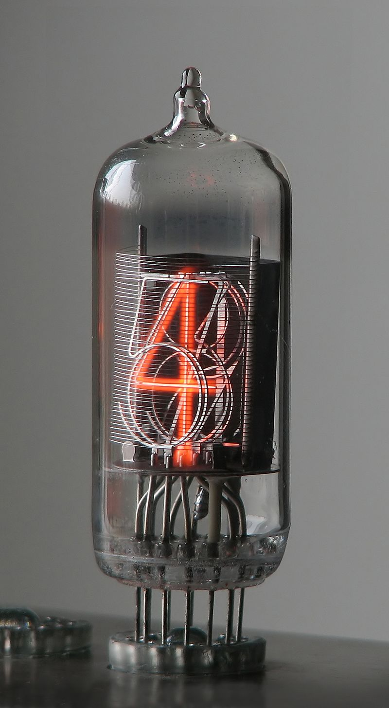
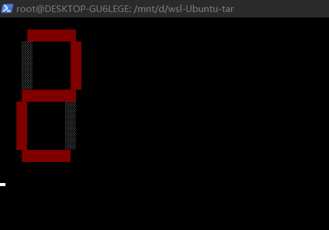

# 操作系统上的程序

Q:什么是"程序"?

# 快速回顾：状态机与数字电路
1. 数字逻辑电路

> 逻辑电路读取当前数据->计算->存回去
* 状态 = 寄存器保存的值

* 初始状态 = RESET

* 迁移 = 组合逻辑电路计算寄存器下一个周期的值

* c的实现

  ```c++
  #define REGS_FOREACH(_)  _(X) _(Y)
  #define RUN_LOGIC        X1 = !X && Y; \
                           Y1 = !X && !Y;
  #define DEFINE(X)        static int X, X##1;
  #define UPDATE(X)        X = X##1;
  #define PRINT(X)         printf(#X " = %d; ", X);
  
  int main() {
    REGS_FOREACH(DEFINE);
    while (1) { // clock
      RUN_LOGIC;
      REGS_FOREACH(PRINT);
      REGS_FOREACH(UPDATE);
      putchar('\n'); sleep(1);
    }
  }
  ```

  关于状态机迁移的程序表达中宏的解释,[见这里](../cpp/0404_new_cpp_style_01.md)


2 .  更完整的实现：数码管显示

* what is？

  命运石之门 世界线变动率探测仪

  

* 实现：数码管显示 0 -> 1 -> 2 -> 0 -> ...

  模拟七段数码管的逻辑 [logisim.c](./code_exp/logisim.c)

  简单“前端”[seven-seg.py](./code_exp/seven-seg.py)

  命令行中键入`./a.out | python3 seven-seg.py` ，效果：

  

* Unix命令行思想，**把命令通过管道的方式连接起来**


# 什么是程序（源代码视角）

1. 表面上：源代码，可以编译运行

   

2. 程序就是状态机

* c程序是状态机？

  状态 = 堆+栈

  初始状态 = main第一条语句（时的堆栈）

  迁移=执行语句

* c程序的状态
  1. 全局变量 当然是状态的一部分
  2. stack frame 栈帧？？
  3. c程序的跳转？
  4. 汉诺塔的非递归实现


# 什么是程序（二进制代码视角）

